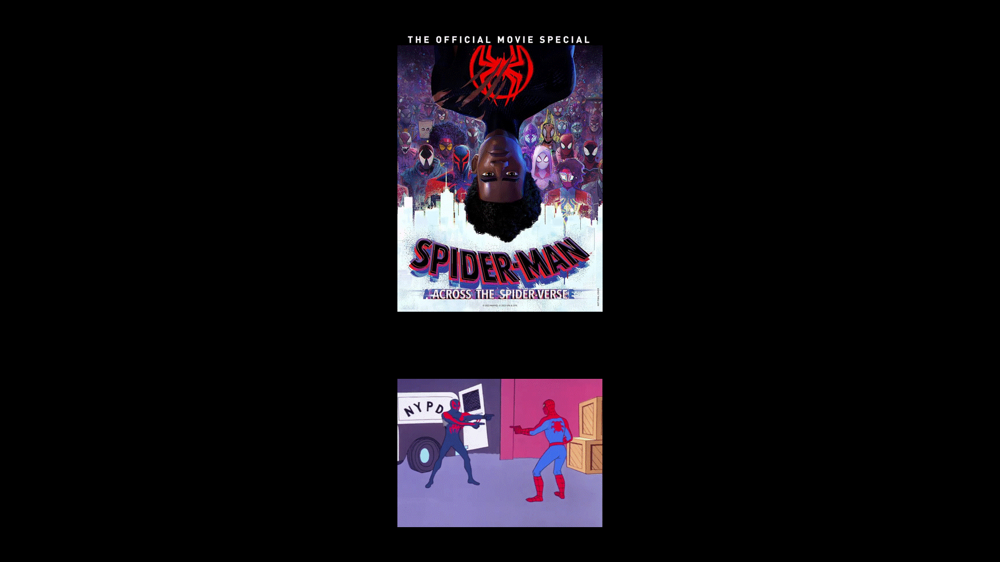

# 06-thesis:  The Visual Web of Spider-Man: Into the Spider-Verse.
[WATCH THE VIDEO PRESENTATION HERE](https://drive.google.com/file/d/1Ha67FUU2XPJKaCEItYDMT8LmiNXkBjgu/view?usp=sharing)

## SLIDE 1
Imagine a cinematic experience where the lines between comic book panels and the big screen blur, where animation crosses boundaries to create a VISUAL MASTERPIECE.

## SLIDE 2

Welcome to the visual web of Spider-Man: Into the Spider-Verse.

## SLIDE 3

This Oscar-winning movie CHANGED the animated film industry with its groundbreaking use of 3D and 2D animation.

Let’s explore the visual world of Spider-Man: Into the Spider-Verse, its main HERO – MILES with other spider-characters and the main villain Kingpin.

## SLIDE 4

Before I dive into the wonders of it all, I would like to state THE REASON I chose this film as the focus of my bachelor essay. This movie just FASCINATES me! Its visuals storytelling, the characters’ journey, the message that it is showing, the wonderful soundtrack that I listen to daily, and the voice acting is just as amazing as the animation.

As I was doing research for this project, I kept finding more and more captivating information about the whole creative process - I had to choose what things to include. So - take this as a summary or an invitation to my bachelor essay.

## SLIDE 5

Starting with the first component of this movie – THE OVERALL VISUAL STYLE - The creators drew inspiration from the classic Marvel comics and so they did with the story.  

The pictures that I have here are the examples of the various inspirations. 

The top left picture is onomatopoeia.

The bottom left is hatching that they used in the movie to shade dark areas. They also used half tones and colour separation to:  first – light an objects within the scene; second – to show depth of field and not use lens blur. 

The right column shows the panels of Spider-man’s origin story – the comic itself is in the movie.

## SLIDE 6

In the left picture is another example – THE KIRBI DOTS – named after the characteristic element of Jack Kirbi’s art style.

On the right is the use of the dots in the film.

## SLIDE 7 & 8 

As I mentioned before, the movie takes ideas for the story from the comics.

On the left is the panel in the comic and on the right is the moment in the movie - 

– and so is here. 

## SLIDE 9

As I said before, the movie demonstrates itself as a comic – here each spider-character has their own spider-man volume.

## SLIDE 10

When one of the spider-men is telling his story – the screen splits into comic book panels that are divided by spider webs.

## SLIDE 11

The same technique is used when Miles is overwhelmed - all the sources of noises are huge and popping behind him. 

## SLIDE 12

To increase the stylized look, the animators turned off motion blur in the animation software and used SMEARS instead. This method is used on fast moving objects, mostly in 2D animation by adding extra lines or shapes.

## SLIDE 13

Here is the work behind the method.

In the bigger pictures there are frames from the movie and in the smaller pictures there are screenshots from the software – it is initially what the person who is working on the scene sees.

## SLIDE 14

Here are 9 frames from the movie that showcase a distinguishable visual style. This movie is truly a piece of art – every frame is unique illustration.

## SLIDE 15

First thing that make those illustrations pop are onomatopoeias. It is used to indicate sound and action. All the pictures I have here are frames from the movie except the top left one, which is from the official art book that I own.

## SLIDE 16

Second thing that makes the illustration pop is line art on the characters’ 3D models. The artists used a specific software that they trained to create the lines.

If this had been drawn manually, it would have required an immense amount of labour. While this could be considered a form of artificial intelligence, in this context, it doesn't replace the artist but actually assists them.

## SLIDE 17
The second component is CHARACTER DESIGN.

Great example is in the picture that I have here. The creators of this movie wanted to amplify the spider design, so the characters together resemble a huge spider. 

Now – let’s see the individual spiders!

## SLIDE 18
Firstly, the protagonist and hero of the movie – Miles Morales.

## SLIDE 19
He dresses casually —hoodies, jeans, and sneakers— making him already a relatable teenager.

After Miles gets bitten by radioactive spider - over time, he discovers his unique powers, including invisibility and electricity.

As he wants to learn his role as Spider-Man, he starts by buying a cheap merch of the Spider-Man suit for kids, obviously it doesn’t fit him. During this phase he is animated at only 12 frames per second (to be precise each pose is hold for two seconds).

## SLIDE 20
These sketches from the art book are highlighting his journey as a teenager and a superhero.

## SLIDE 21 & 22
**`First is the animation of the slides. `**

A pivotal moment tied to Miles Morales' character development is a famous "Leap of Faith" scene – it symbolizes his confidence as he embraces his identity as Spider-Man. This ties to Miles’s version of Spider-man costume design and the 3D model of the environment he is in.

## SLIDE 23 

Here I have pictures from the creation of the scene and the frames from the movie.

In left column the first two pictures are the layout in the animation software and the last one is the shot from the movie.

In the middle and right column: it’s what the animators sees and the second are the frames.

Additionally, the script of the scene provides context and dialogue, tying together the visual elements with the narrative.

## SLIDE 24
Here are more frames from the scene. The right photo once again evokes a comic book feel.

## SLIDE 25
In the following video you will see the shots versus the scene.

/put the video or GIF here/

## SLIDE  26 
After this scene Miles Morales is now Spider-man of this universe therefore he gets his own spider comic-book volume.

## SLIDE 27
Other component of this movie are visual parallels that depict how Miles evolves as a hero through the movie.  Here are some examples:

## SLIDE 28
In the left column I have moments before Miles becomes Spider-man and then the right one is after it.

The first row shows Peter Parker confidently being Spider-Man, then Miles Morales fits into the role of a hero.

In the second row when Miles is trying to be Spider-Man in a cheap suit, he falls down yelling in horror. However, after taking leap of faith, he is screaming in excitement because he is having so much fun as a Spider-man now.

In the third row he does not fit into the mask of Spider-man and then he does. 

In the last row Miles’ uncle gives him an advice that he later uses to defeat the villain.

## SLIDE 29
At last, this moment during the final fight, Miles uses the move he saw Peter Parker do.
/ PUt THE GIF HERE / 

## SLIDE 30
Two mentors essential to Miles' hero development are PETER PARKER (whom the people in the studio call RIPeter) and PETER B. PARKER (the "B" stands for burnout).

While RIPeter sends Miles on the journey to become Spider-Man and destroy the collider (the machine that pulls the other spider-characters from their dimensions.) Peter B. Parker teaches Miles how to be Spider-Man and is the one who tells him to take a leap of faith.

The designs of both Peters have the same base, but they are two different characters with different personalities, which is reflected in their designs.

Peter Parker is the perfect superhero, essentially a celebrity, with blond hair, blue eyes, a perfect build, and a flawless face.

Peter B. Parker, on the other hand, is tired and depressed after being left by MJ. He is burned out, wears sweatpants over his suit, and has been eating a lot of junk food.

## SLIDE 31
Miles and the Peters are not the only Spider-Men in this movie. In the frame shown here, from left to right, we have Spider-Gwen, Peni Parker, Spider-Man Noir, and Spider-Ham.

## SLIDE 32
First character is Spider-Gwen.  Her suit design resembles a ballerina, which reflects in her fighting style and in the animation. The hood adds a modern touch to the suit.

In the pictures I have here is Gwen’s own comic book issue, her variant of spider-man pose, her hair cut, suit design and few frames from the movie like her next to Miles and Peter B. Parker.

In the bottom left picture, you can see another use of smears. In this scene she is very fast compared to Miles’ and Peter B.’s messy combination of swinging styles. 

## SLIDE 33
Next character is Spider-Ham. He is the most cartoon-like of them all because his animation is inspired by Looney Tunes. For example, when he smells delicious food, he starts to float, or he pulls a big wooden hammer out of nowhere. 

The sketches from the art book show how the artist experimented with Spider-Ham’s cartoon poses.

When he falls back into the collider and returns to his universe, the city is depicted in a cartoony style, matching his aesthetic.

## SLIDE 34 & 35
Another exaggerated character is Peni Parker. For her the designers drew inspiration from anime and manga, so her animation is in classic anime poses and movements.

Above her name there is expression sheet in which the artist played with her anime-hood.

Unlike other Spider-characters, she has a spider-themed mechanical suit, which she pilots telepathically.

As Spider-Ham has own themed collider city, Peni’s one is in her colour palette.

She has very bright colours in her design contrary to her is –

**`Cut to the next slide! `**

– SPIDER-NOIR. His whole universe including himself is in black and white. It references older comics and the Film Noir genre itself. He narrates dramatically, and according to the sketches from the art book he also has old timey vocabulary.

Spider-Man Noir collider city is obviously matching his aesthetic. 

 

## SLIDE  36 

I have showed you the good guys of the story, now I present you the main villain – KINGPIN!

## SLIDE 37
In terms of his design, he's simply a gigantic black square – as shown in the left picture.  Next to it I have exploratory sketches from the development of the movie. The top ones are his fighting style the bottom ones are his expressions with him taking up majority of the canvas’ space.

## SLIDE 38
In the photos is his design in action.

The shots of Kingpin are often taken from below to emphasize his power. Although in the 1st picture of the left column Kingpin is tall, Olivia Octavius rises above him, signifying his losing power.

He occupies those with his gorilla-like posture, and his face is always painted with negative emotions, showcasing his power and the pure radiating fear.

In the right column there are flashbacks, where Kingpin looks like a soft ball rather than threatening. The watercolour style of the scene adds a gentle touch.

The pain from the loss of his wife and son, drives him to override basic moral values and the law, leading him to kill Spider-Man. And with help of scientists to create the collider.

## SLIDE 39 
While Spider-Man: Into the Spider-Verse was still in making so was the series Arcane (2021) both works combine 2D and 3D. And these animated works both inspired the wave of stylised mixture of 3d and 2d elements like the film The Bad Guys (2022) and a movie Teenage Mutant Ninja Turtles: Mutant Mayhem (2023). 

## SLIDE 40
In conclusion Spider-Man: Into the Spider-Verse with its uniqueness, initiated a new trend in the animation industry, mainly the combination of 3D and 2D animation. In my opinion, this is amazing because it represents a significant step forward from the constant live-action adaptations and remakes. At the same time, it also returns to the roots of classic 2D animation.

## SLIDE  41
**`DRAMATIC SOUND! `**

## SLIDE 42

**`Post credit scene type of vibe. `**

And then 5 years later second Spider-verse movie came along.

